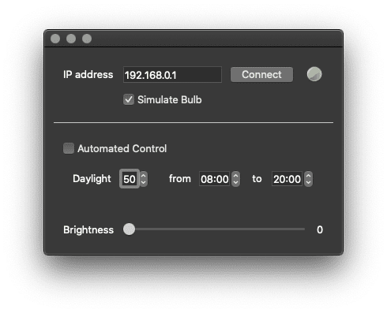

# GUI controller for Smart Light Bulb

## What is this

This is a GUI controller for a [Kasa Smart Bulb](https://www.amazon.co.uk/gp/product/B07KXFSBLR). The idea is to control the brightness remotely for various scientific reasons.



## Using the code

Use the following command to execute the script

```sh
python3 bulb_control/bulb_control.py 
```

Or you can use a shorter version

```sh
./bc
```

## Main functions

The main function that the GUI offers are to following,

1. Changing the brightness of the bulb manually,
2. Setting up a day-to-night shift and have the brightness being changed automatically.

More features are being added.

## Using the GUI

1. Input the IP address of the bulb, and uncheck the "Simulate Bulb" box.
2. Click "connect" button, if the connection were correct, the indicator will be a green sphere, otherwise it would be a red cross.
3. To change the brightness manually, drag the brightness slide.
4. To start the automatic mode, check the "Automated Control" box.

## Extra Stuff: Establishing the connection

I want to remote control the smart bulb whom located in a university lab in UK. It is not very straightforward because there are some restrictions for the internet access using the [eduroam](https://www.eduroam.org) system.

There is a small WIFI network that comes with the smart bulb. Thanks to this extra WiFi, I managed to connect everything together. Firstly, I connected my Raspberry Pi to this WiFi to access this smart bulb. Then I physically connected my PC to the Raspberry Pi, while the PC had Internet access using eduroam. See the following chat for what I meant.

```
┌─────────────┐                          
│     Me      │                          
└────┬───▲────┘                          
     │   │                               
   Any Method          ┌─────────────┐   
     │   │             │             │   
┌────▼───┴────┐        │ Smart Bulb  │   
│  Internet   │        │             │   
└────┬───▲────┘        └────┬───▲────┘   
     │   │                  │   │        
    Eduroam              Local WiFi      
     │   │                  │   │        
┌────▼───┴────┐      ┌──────▼───┴───────┐
│             │  SSH │                  │
│    My PC    ├──────▶   Raspberry Pi   │
│             │      │                  │
└─────────────┘      └──────────────────┘
```

This is only way I figured out to remotely control a device, while bypassing the restrictions from Eduroam. I am really bad with internet, and you probably will have better solutions.